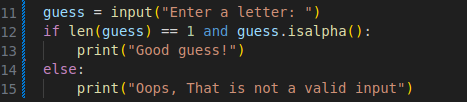
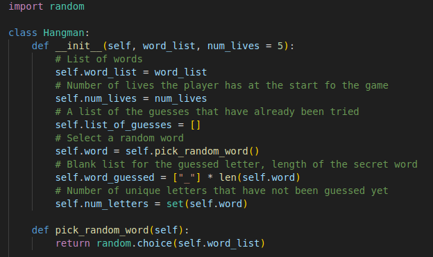
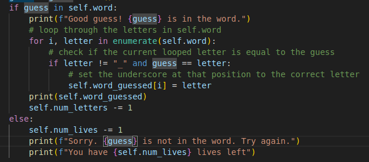

# Hangman

Hangman is a classic game in which a player thinks of a word and the other player tries to guess that word within a certain amount of attempts. This is an implementation of the Hangman game, where the computer thinks of a word and the user tries to guess it.

## Milestone 1: Set up the environment

In this project, we'll use GitHub to track changes to our code and save them online in a GitHub repo called hangman

## Milestone 2: Create the variables for the game

* Created a local version of the repo with *git clone*
* Created a file named **milestone_2.py** which will contrain the code for this milestone.
* Created a list of words, in this case 5 fruits and assigned the list to a variable called **word_list**.
* Imported the **random** module.
* Used the **random.choice** method to assign a random word from **word_list** to the variable **word**, which will serve as the secret word.
* Used the **input()** method to request a letter from the user and assign it to the variable **guess**
* Created an **if** statement that checks if the length of the input is equal to 1 and is alphabetical:

* Created a **README.md** file and began documenting my experience
* Uploaded files to Github repo

## Milestone 3: Check if the guessed character is in the word

* Used a **while** loop to continuously ask the user for a letter and validate it (with the code from the image in milestone 2)
* Check if the guess is in the secret word with **'if guess in word:'** statement which feeds back to the user accordingly
* Created the **check_guess** function which:

* Created the **ask_for_input** function which asks the user for a letter, validates it, then calls **check_guess**

## Milestone 4: Create the Game class

* Created a new file **milestone_4.py** to house the code for this mielstone
* Created the **Hangman** class and defined the **init** method with the attributes as per the image below:

I decided to define a method **pick_random_word** to pick a random word and assigned it to the **word** variable
* Defined the **check_guess** method similar to in milestone 3
* Defined the **ask_for_input** method, similar to milestone 3 a while loop is used to repeat the request for a valid input. Added a check to see if the guess has already been tried by recording each guess in the **list_of_guesses** attribute and checking the list before the **else** block which calls the **check_guess** method.
* Added code the **check_guess** method to replace the underscores in the **word_guessed** with the letters guessed by the user. I used the enumerate method to replace the corresponding index with the **guess** as per below:

I also added a minus counter to reduce the variable num_letters.
* Defined what happens if the guess is not in the word by adding a minus counter to the variable **num_lives** in the **else** block and then printing the lives remaining.

## Milestone 5: Putting it all together

* Created a new file **milestone_5.py** for the new script
* Copied the code from the **milestone_4.py** file
* Defined a new function **play_game** which takes word_list as a parameter which will contain the code to launch the game: 

1. We set the initial value of **num_lives** to 5.
2. We create an instance of the Hangman class using a provided **word_list** and **num_lives**.
3. Inside the while loop, we check whether **num_lives** is 0. If so we break the loop and as the game is over.
4. If num_lives is not 0, we call the **ask_for_input** method and the game continues.

In the **Hangman** class we have:
* The **init** method as per milestone 4* 
* The **pick_random_word** method which selects a random word from the **word_list**
* The **check_guess** method which:
1. Converts the guessed letter guess to lowercase using **guess = guess.lower()** to ensure case-insensitive comparisons.
2. Checks if the guessed letter **guess** is in the **self.word**. If it is, the letter is correctly guessed, and we update the **self.word_guessed** list accordingly by replacing the underscores with the correct letter.
3. If the guessed letter is correct, we decrement the **self.num_letters** attribute by 1 to indicate that there is one less unique letter left to guess.
4. If the guessed letter is incorrect, we decrement the **self.num_lives** attribute by 1 to represent that the player lost one life.

* The **ask_for_input** method which:
1. Begins by printing the current status of the word being guessed, represented as underscores and correctly guessed letters stored in **self.word_guessed**.
2. It enters an infinite loop using while True
3. Inside the loop, it prompts the player to enter a letter guess using **input**. The player's input is stored in the variable **guess**.
4. The method performs some input validation to ensure that the player enters a valid letter by checking if the length of the input guess is not equal to 1 and if the input guess is not alphabetic using **guess.isalpha()**.
5. If the input passes the validation checks, it proceeds to check if the letter guessed is correct by calling the **check_guess** method.
6. After calling **check_guess**, the guessed letter is appended to the list of guesses stored in **self.list_of_guesses**.
7. If **self.num_lives** becomes 0 during the process, it means the player has lost the game. In this case, the method prints "You lost!" and returns False to signal the game outcome.
8. If **self.num_letters** becomes 0 during the process, it means the player has guessed all the letters correctly and won the game. In this case, the method prints "Congratulations. You won the game!" and returns True to signal the game outcome.
9. The return statement inside the loop is used to break the loop and return the game outcome to the play_game function. The loop will continue asking for input until one of the return statements is executed, thus allowing the game to continue until either the player wins or loses.

The function will keep running until the player wins the game or runs out of lives.
